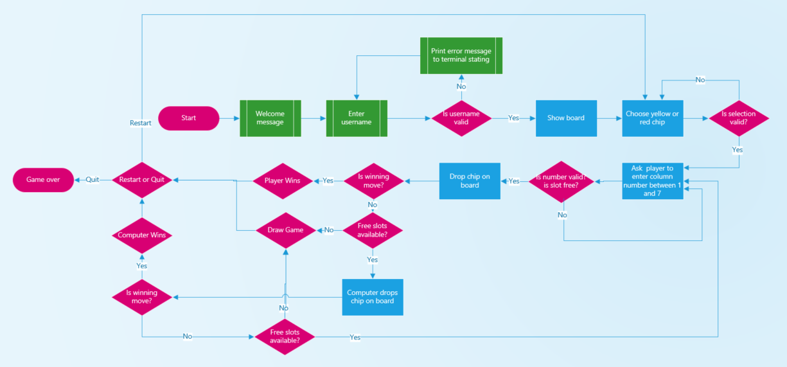
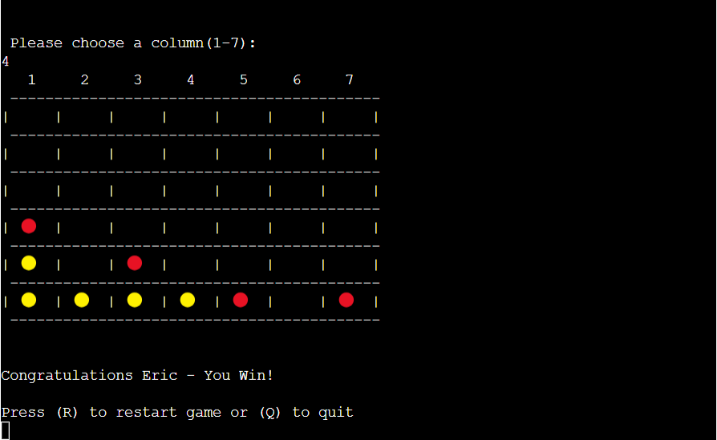
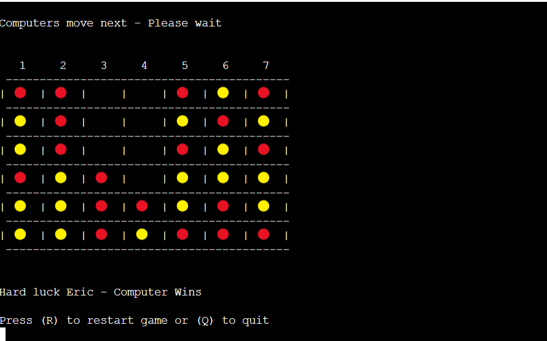

# Connect-4

## How to play:
Connect 4 is a Python terminal game, which runs in the Code Institute mock terminal on Heroku.

Connect 4 is a two-player connection rack game. My version of the game has been modified in to a one player game, where the player plays against the computer. The player takes turns dropping coloured tokens into a six-row, seven-column vertically suspended grid. The pieces fall straight down, occupying the lowest available space within the column. The objective of the game is to be the first to form a horizontal, vertical, or diagonal line of four of one's own tokens. You can read more about it on [Wikipedia](https://en.wikipedia.org/wiki/Connect_Four "Wikipedia")

-By Eric Blake

# [Live site](https://connect-4-eb-e1e4322e00d6.herokuapp.com/ "Live site") 

## UX

### Strategy
* Build a simple, fun and challenging game that will engage the player.

### Target Audience
* Anyone with an interest in playing online games.

### User goals
* I want to see clear instructions on how to play this game.
* I want to easily navigate through the application.
* I want to get feedback on my actions in the game.
* I want to re-start the game quickly without having to go through how-to-play instructions again.

### Site owner objectives
* I want to provide a fun gaming experience.
* I want the app to be visually pleasant and readable.
* I want to add a competitive element to the game.

## UX design:

### Wireframe
As this is a Python terminal game, a wireframe was not deemed necessary.

### Structure & Logical Flow
A flowchart of the game flow and logic was created using Microsoft Visio. The flow charts shows how the game will flow and allows consideration for the inputs, outputs and validation required.

### Colour Scheme
* The game chip colours of red and yellow are used. This is the standard colour scheme for the Connect 4 game.

## Features:

### Existing Features

#### Welcome page
* The first section is welcoming the user to the quiz and requesting a username. This is validated so that the username must be two or more letters.

#### Instructions
* The next section gives the user information and instructions on how to play the game. The user must select a chip colour, "y" for yellow or "r" for red.

* The user is then prompted to enter a column number between 1 and 7. This is validated to only accept numbers between 1 and 7.

* After selecting a number, the chip will be dropped in the board and the board re-printed.
* The computer then selects a column at random and drops a chip.

* If the user wins a congratulations message will be displayed.

* If the user loses a hard luck message will be displayed.
* If there is no winner a game over - draw message will be displayed.
* At the end of the game the user will have the option to play again or quit. This is validated to only accept the letters "r" for restart or "q" for quit.

### Future Features
* Allow player to select the board size by inputting the number of rows and columns.
* Add a multiplayer feature.
* Add a leader board with top scores get stored in google sheets.

## Technologies Used

### Coding languages used
The only coding language used in this project was Python3.

### External resources:
* Microsoft Visio was used for the Flowchart.
* Heroku: Heroku is used to deploy the programme in the form of an app. This is supported by the Code Institute template that allows a python terminal to be run using a web page.
* Code Anywhere was used as the IDE to code the website.
* Code Institute template - To run the game in the terminal using Heroku.

### Libraries Used
* (random) was used to generate column number for the computers move.
* (time) was used to pause between player move and computer move.
* (sys) was used for the print slow function.
* (os) was used for the clear function.

## Testing:

### Manual Testing
| Test | Result |
| ------------- | ------------- |
| The welcome page and quiz page and are all readable and easy to understand  | Pass |
| User name is validated, if no username or invalid username is entered a warning message is displayed   |Pass  | 
| Chip colour selected is validated. If no chip colour or invalid character is selected a warning message is displayed   |Pass  | 
| When game begins the empty board is displayed   |Pass   | 
| When the user selects a column number the chip is dropped in correct column  |Pass   | 
| Colum selected is validated. If incorrect column number is selected a warning message is displayed |Pass   | 
| If the column selected is full a warning message is displayed |Pass   | 
| The turns are incremented correctly  | Pass  | 
| The check winner function works in vertical, horizontal and diagonal directions  | Pass  |  
| When the user selects play again the game restarts  | Pass  | 
| When the user selects quit game the game quits  | Pass  | 
| Play again and restart is validated. If invalid character is selected a warning message is displayed   | Pass  | 
| The lower() method is working correctly in the player chip colour and restart functions |Pass   | 

### Validator Testing:
 * No errors were returned when passing through the PEP8 validator. 
    

## Bugs
* ### Fixed bugs
| Test | Result |
| ------------- | ------------- |
| Issue with first row showing on top of board instead of bottom  | Updated get_row function so that it goes to first row 0, and subtracts 1 every loop |
| Turns was not resetting to zero after game restarted  | Added game = 0 to start game function|
| If random number generated for computer move was a column that was full, then no move would be made  | Added loop to computer move function to keep generating random numbers until it finds an available column |

* ### Unfixed Bugs
No unfixed bugs

## Deployment and local development
### Deployment
* This project was deployed using Code Institutes mock Terminal for Heroku
* Steps for Deployment 
    * From Heroku Dashboard, select Create new app from the dropdown menu.
    * Add a unique app name and then choose a region closest to you (EU or USA).
    * Click on Create App.
    * Go to support dependencies and select Add Buildpack.
    * The order of the buildpacks is important. Select Python first, then save changes. Then add Node.js second and save changes. If they are not in this order, you can drag them to rearrange them.
    * Add config VAR - key is PORT and the value is 8000.
    * Go to Deploy tab and select deployment method - Github, then click connect.
    * Enable automatic deploy so Heroku updates app each time changes are pushed to Github.
    * Click on View button to take you to your deployed link.

### Cloning the repository
The repository was cloned to my local PC. The steps to clone are as follows.
* In the Github repository, navigate to the main page of the repository.
* Click on the green Code button and copy the URL.
* Select Clone by HTTPS option.
* Open the code editor and within the terminal change the directory to the location you want to clone the repository to.
* Type git clone and paste the URL copied earlier.
* Press enter to create the local clone.

### Forking the repository
By forking the repository, you can make a copy of the repository and make changes without affecting the original repository. the steps to fork are as follows:
* Locate the repository in Github.
* On the top right corner of the page click Fork.
* A copy of the repository will now be created in your own repository.

## Credits
 * Instructions throughout project was taken from [Code Institute](https://codeinstitute.net/ie/ "Code Institute") Tutorials and Love Sandwiches project.
 * The flowchart was created using Microsoft Visio.
 * The Favicon was taken from [Icons8](https://icons8.com/ "Icons8").
 * isalpha method, time delay, clear, print slow from stack overflow  [Stack overflow](https://stackoverflow.com/  "Stack overflow").
 * Details of Connect-4 game [Wikipedia](https://en.wikipedia.org/wiki/Connect_Four "Wikipedia").
 * How to create a 2d array from [GeeksforGeeks](https://www.geeksforgeeks.org/python-using-2d-arrays-lists-the-right-way/ "GeeksforGeeks").
 * Title art generator [Patorjk]( https://patorjk.com/software/taag/#p=display&f=Big&t=Connect%204 "Patorjk").

## Acknowledgements
*  Mitko Bachvarov. My mentor who provided me with advice and feedback throughout this project.